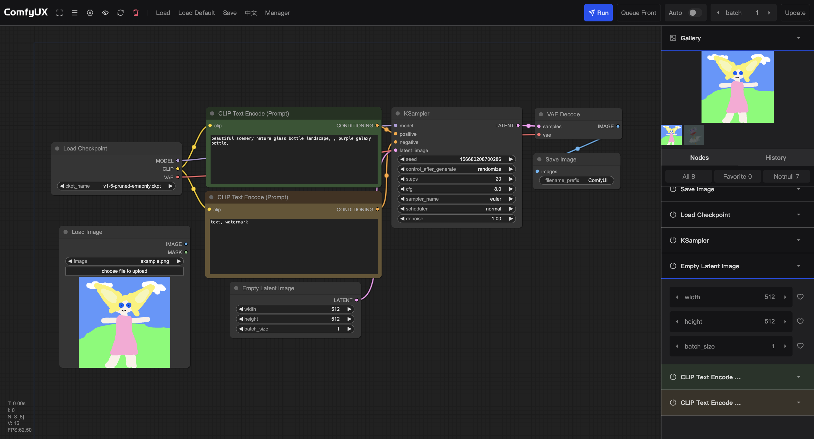

ComfyUX
=======
如果你淹没在上百个节点中，ComfyUX能让你脱离苦海 
If you are drowning in hundreds of Nodes, ComfyUX can save you from the misery

[产品文档 Product DOC](https://y3bpnk8e3u.feishu.cn/docx/RFIrd1kcbotTa7xqis5cKiKhnRf)

-----------

## 背景
- 当工作流创建完成时，进入批量生图阶段，在画布里寻找散落在各地的节点和参数真的很痛苦
- ComfyUX将节点按顺序排列，同时支持收藏高频参数功能，旨在提高批量生图时的微调效率
- 另外，收藏列表可以保存到.json中，作者在分享自己的工作流时，可以同时分享收藏参数，降低学习门槛

## Background
- When the workflow is setup, it enters the Batch-Generating stage. It is really painful to find Nodes and Parameters scattered all over the canvas
- ComfyUX arranges the nodes in order and supports add high-frequency parameters to favorite, to improve the efficiency of fine-tuning when batch drawing
- In addition, the collection list can be saved to .json. When sharing your workflow, the author can also share the collection parameters to reduce the learning threshold

## 安装教程
- [下载ComfyUX](https://github.com/googincheng/ComfyUX/releases/latest/)
- 解压至"（你的ComfyUI路径）/custom_nodes" 目录下
- 重启ComfyUI

## Install
- [Download ComfyUX](https://github.com/googincheng/ComfyUX/releases/latest/)
- Unzip it to "(your ComfyUI path)/custom_nodes" directory
- Restart ComfyUI

## 功能
- 节点参数面板
- 收藏高频参数，便于后期调参
- 生成图片展示区

## Feature
- Node Param panel
- Collect high-frequency parameters for easy parameter adjustment later
- Generated image Gallery

## Artist Support
- [@xiongmu - Openart](https://openart.ai/workflows/@xiongmu)

如有帮助，请Star这个项目给予作者支持！
If it helps, please Star this project to support the author!

[了解更多 More](https://y3bpnk8e3u.feishu.cn/docx/RFIrd1kcbotTa7xqis5cKiKhnRf)
